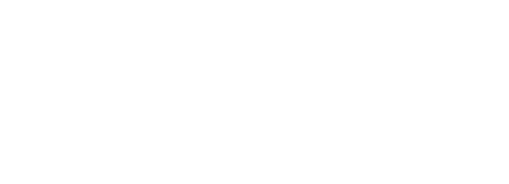

# Regresion
Funciona como una caja negra
El modelo de regresión lineal funciona como en matemáticas/estadística

Al parefer segun cosas que tengo que recordar de bachillerato para hallar el minimo de una funcion hay que hacer la derivada, la integral es para hallar el área.
Que carajos es una derivada parcial?

por lo visto hay que ir modificando los valores de Alpha y W hasta llegar al minimo?

|--|--|--|
|Edad|Salario|Banco|
|30|23|10|
|40|35|15|
|x_1|x_2|y|

$Y`(fWb(/overline{X}))=w_1*x_1+w_2*x_2+b$

w_1 =1
w_2 =2
b=1
y^`_1 = 30*1+23*2+1=77

y^`_2 = 40*1+35*2+1=111

${1}{2m} /sum^{n}_{i=1}(Y^{'}_1-Y_{\omega})$
$(77-10)^2 + (111-15)^2 = 13705$
Esto dividido entre 2 porque es /2m del sumatorio donde m es el numero de ejemplos de caso
3426.25

En los casoss sucesivos hay que ir modificando los valores de $w_1$ y de $w_2$

$w_1=w_1-\alpha*\sum_{\forall i}(y^{'}_{i}-y_{i})*x_{1i}$
$w_2=w_2-\alpha*\sum_{\forall i}(y^{'}_{i}-y_{i})*x_{2i}$

$w_1=1-0,5$ esto ultimo es el valor de $\alpha$
$\frac{(77-10)*30+(111-15)*40}{2}=\frac{2010+3840}{2}=292.5$
El valor es $W_1=291,5$ al restarle el 1 de alguna cosa que nor ecuerdo

Para evitar imprecisiones en los datos tenemos que normalizarlos.
Podemos dividirlos por la maxima, calcular la media y la dev tipica para restarsela....

## 2.3 clasificacion
Podemos definir diferentes sistemas por ejemplo si contiene valores discretos o contiene decimales.
Para estos problemas discretos los modelos de regresión pueden ser imprecisos.

Para ello tenemos que buscar convertirlo en valores discretos

## 2.4 Regularizacion
Para evitar la sobreadeptacion usamos una cantidad de ejemplos y una de comprobaciones.
Los datos pueden no ser suficientemente representativos del problema, que falten casos limites, o que sean demasiados dispares.
Comprobar atributos que introducen ruido. En caso de una clasificación de mamíferos comprobar el pelo no es fiable, las ballenas no tienen pelo.
Estos atributos podrian detectarse solos en la muestra y bajar su peso.
la varianza es lo contrario del sesgo.

2.4.6.1 los valores de lambda tienen que ser mayor de 0 porque si no implica la no penalizacion. valores superiores de 1 reducen overfitting pero aumentan sesgo

2.4.7.1 El error del dataset es la media de los errores de los ejemplos.
