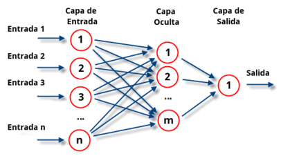
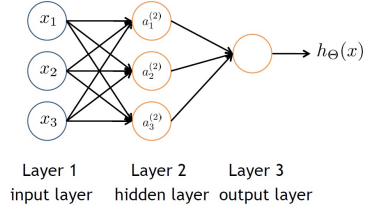

# Redes Neuronales
Las redes neuronales surgen de las analogías entre la naturaleza y las invenciones humanas.
En los años 50 se comienza a intentar replicar el funcionamiento del cerebro humano en los primeros ordenadores sin demasiado éxito más allá del planteamiento.
En los años 80 se comienzan las primeras implementaciones con el algoritmo de propagación (Backpropagation).
El sistema nervioso controla los seres vivos y está compuesto de neuronas, las cuales replicaremos con nuestras redes artificiales.
Las neuronas están compuestas de Axiones que propagan los impulsos a otras neuronas y las dendritas que procesan las entradas de las neuronas, este proceso de intercomunicacion de las dendritas se llama *Sinapsis*.
De media el número de interconexiones en cada neurona es de unas 10000.
Intentar replicar eso en un sistema convencional es harto difícil.

Esta analogía es muy simple en comparación con la realidad del cerebro.

una neurona activación es capaz de activarse y de modular la cantidad de "energía" que le llega mediante salidas a otras neuronas.
La función que nos indica la activación se llama *Función de Activación*
Cada entrada de la neurona se pondera con un peso diferente que simula el funcionamiento de la sinapsis.
Esta idea se aplica en un tipo de red conocida como Perceptrón Multicapa
$$\boxed{\text{Capa neuronal de entrada}}\rightarrow \boxed{\text{Capa/s oculta}} \rightarrow \boxed{\text{Capa de salida}} $$


Cada una de estas conexiones se pondera con diferentes pesos, una neurona de la capa entrada puede conectarse con peso $0,1$ a la primera de la siguiente, $0,5$ a la segunda, $0,3$ a la tercera....
Una red neuronal puede definirse como un vector de ecuaciones:
$$\vec{S}=F(F(F(\vec{X}*W_{1})*W_{2})\dots W_{i})$$
Si la función es lineal, añadir más capas de neuronas no cambiará el resultado, por lo que  puede ser sustituida con una capa simple, normalmente no lo suelen ser.

### Funciones de activacion

Funcion escalonada
$$y(x)=\begin{cases}1 \qquad \text{si}\quad x\geq \alpha \\ -1 \quad o \quad 0 \quad \text{si}\quad x\leq \alpha\end{cases}$$

## 3.3 Perceptrón Multicapa

Forward Propagation



## How dows an ANN learn?

$a^2_3=a^{'}_1*\theta ^{'}_{3,1}+a^{'}_2*\theta^{'}_{3,1}$

```python
float a[1];
float a2[3];
float a3[1];
float Tetha1[3,2];
float Tetha2[1,2];

for c in a2 # para todas las neuronas de la capa 1
for j in a1
a[i]=ai[j]*t1[i,j]
```