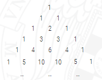

# Programación Dinámica

Algunos problemas se pueden implementar de manera muy natural y directa utilizando recursión, como es el caso por ejemplo de los números combinatorios. Sin embargo, dicha implementación recursiva directa sufre en muchos casos de un elevado coste debido a la repetición de llamadas recursivas.

La programación dinámica pretende evitar esta ineficiencia mediante el uso de una tabla donde se almacenan las soluciones a subproblemas ya resueltos. De esa forma, cuando sea necesaria la solución de un subproblema ya resuelto previamente no será necesario repetir de nuevo los cálculos sino solamente consultar la tabla.

El siguiente vídeo introduce el método algorítmico de la programación dinámica y lo aplica al cálculo del número combinatorio (nr)
 que representa el número de formas posibles de elegir r
 elementos distintos de entre n
 posibles sin tener en cuenta el orden.

### Cambio de monedas
En el tema del método voraz vimos que para ciertos sistemas monetarios existe una estrategia voraz para resolver el problema del cambio de monedas en el que se dispone de una cantidad ilimitada de monedas de cada tipo. También vimos que hay sistemas monetarios para los que no hay estrategia voraz y que cuando la cantidad de monedas es limitada la estrategia voraz tampoco sirve incluso en los sistemas monetarios en los que se puede aplicar cuando la cantidad es ilimitada.

En esos casos es necesario tener en cuenta todas las posibles formas de conseguir la cantidad deseada. Sin embargo, el hecho de que para pagar una determinada cantidad con el menor número de monedas es necesario pagar cualquier cantidad inferior también con el menor número de monedas, nos permite restringirnos a considerar solamente esas formas de pagar las cantidades inferiores de manera óptima. Esto se conoce como principio de optimalidad de Bellman, y es necesario comprobar que se cumple para poder aplicar programación dinámica a problemas de optimización.

En el siguiente vídeo se explica cómo aplicar el método de la programación dinámica para resolver el problema del cambio de monedas con cantidad ilimitada de cada tipo de monedas.

### Anotaciones de clase
Consiste en usar Soluciones óptimas para subproblemas hasta optimizar el problema.ñññ
Usada en combinatoria
Triangulo de Pascal

Cada cifra es la suma de las dos superiores.
Sirve para calcular el numero de combiaciones posibles en un problema.

La cuerda del cometa

$L {1,2,...,n} \newline
si\qquad\qquad\qquad\qquad no\newline
L-ln{1,2,...,n-1}   \qquad L{1,2,...,n}\newline
            \text{etc}$

Los casos base podemos separarlos en: 
se puede (i,o)=true
se puede (0,j)=false

2 5 10

1 2 3 4 5 6 7 8 9 10 11 12 13 14 15
1 2 3 4 5 6 7 8 9 10 11 12 13 14 15
IIIIIIIIIII

#### Ejercicio de las obras
tabla con 2 dimensiones para las posiciones de las obras                                                                        '

### Test 
El algoritmo de programación dinámica ascendente en el que se optimiza la cantidad de memoria utilizada que calcula un número combinatorio acaba de rellenar el vector C que corresponde a los números combinatorios $$
 y queda de la siguiente forma $\binom{7}{0}$ $\binom{7}{1}$ $\dots$ $\binom{7}{8}$

||||||||||
|---|---|---|---|---|---|---|---|---|
|0|1|2|3|4|5|6|7|8|
|1|7|21|35|35|21|7|1|0|

Indica qué valores de este vector suma el algoritmo para calcular 
$\binom{8}{3}$
Son necesarios los valores 
$\binom{7}{2}$ y $\binom{7}{3}$, situados en las posiciones 2 y 3 respectivamente por lo que la respuesta es: 
C[2] + C[3] = 21 + 35

2 Al calcular el número combinatorio 
$\binom{n}{r}$ mediante programación dinámica descendente, el número de subproblemas distintos que se resuelven es $n*r$