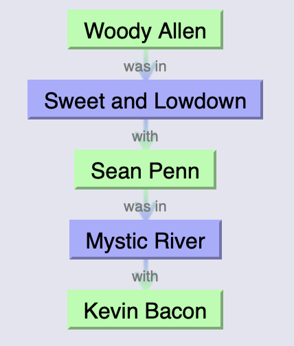
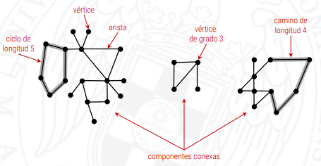
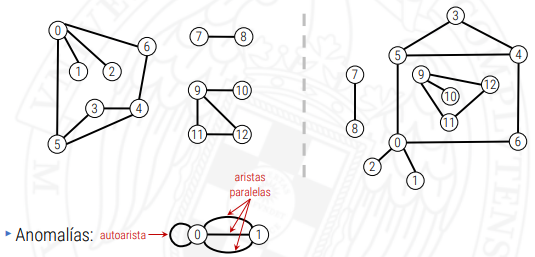
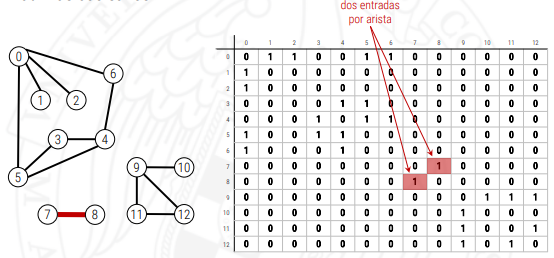
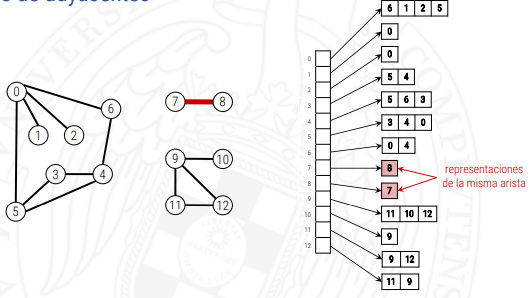
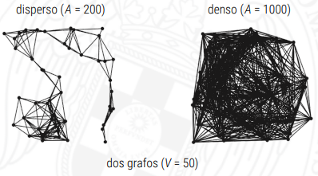
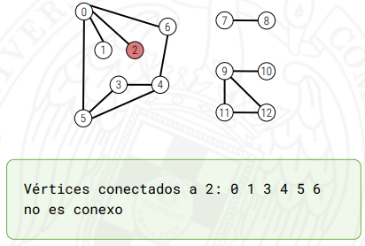

# Grafos no dirigidos y sus recorridos
Objetivos:
>Conocer el TAD de los grafos no dirigidos y cómo pueden utilizarse para modelar aplicaciones.
Aprender un patrón de diseño para resolver problemas sobre grafos de forma independiente a su representación.
Conocer el recorrido en profundidad de grafos no dirigidos y utilizarlo para resolver problemas sobre grafos como la alcanzabilidad entre vértices, o detectar componentes conexas, entre otros.
Conocer el recorrido en anchura de grafos no dirigidos y cómo se utiliza para encontrar caminos mínimos desde un origen.

### 4.1 Grafos no dirigidos
Los grafos son una herramienta para modelar problemas en los que tenemos elementos, representados por vértices en el grafo, y conexiones uno a uno entre ellos, representadas por las aristas. Los grafos pueden ser dirigidos (cuando las aristas están orientadas) o no, y pueden ser valorados (cuando las aristas tienen asociado un valor) o no. Esta semana nos centramos en los grafos no dirigidos y no valorados.

El siguiente vídeo presenta los grafos no dirigidos y cómo pueden representarse en memoria con el objetivo de poder resolver eficientemente problemas de procesamiento de grafos:

https://www.youtube.com/watch?v=Mql9tPi0uAI&feature=youtu.be

Extiende la clase Grafo (implementada mediante listas de adyacentes, como en el fichero anterior) con un nuevo método hayArista que sirva para averiguar si existe una arista que conecte dos vértices dados. ¿Qué coste tiene esta nueva operación?

En el vídeo se habla también de la representación de un grafo mediante una matriz de adyacencia. Aunque no sea la representación más útil en general, hay ocasiones en que sí es la representación más apropiada. Implementa la clase Grafo utilizando una matriz de adyacencia. ¿Qué coste tienen todas las operaciones del TAD con esta representación?

### 4.2 Recorrido en profundidad
El recorrido en profundidad de un grafo explora todos los vértices alcanzables desde un vértice origen. Se puede pasar de un vértice a otro si estos son adyacentes, es decir, existe una arista que los conecta. El recorrido en profundidad imita en cierto sentido una estrategia para resolver un laberinto, donde vamos avanzando mientras podemos desenrollando una cuerda, hasta que llegamos a un sitio sin salida o desde donde podemos llegar solamente a posiciones ya visitadas. En ese caso toca retroceder recuperando la cuerda, hasta una posición donde haya otro camino no explorado. Esta estrategia garantiza que si la salida es alcanzable desde la entrada, la encontramos.

El recorrido en profundidad de un grafo, que se implementa sencillamente de manera recursiva, puede utilizarse para resolver muchos problemas sobre grafos. El siguiente vídeo muestra cómo funciona el recorrido en profundidad utilizando un ejemplo, y utiliza el recorrido para encontrar caminos desde un vértice origen a todos los vértices conectados a él.

https://www.youtube.com/watch?v=W5y3KFz5Pu4

Un árbol libre es un grafo no dirigido, conexo y acíclico, es decir, donde todo par de vértices está conectado exactamente por un camino. El problema 11  Árboles libres del juez automático propone averiguar, dado un grafo, si es árbol libre o no. El problema puede resolverse de manera sencilla utilizando un recorrido en profundidad del grafo.

En el siguiente vídeo se resuelven de forma muy similar dos problemas que en principio pueden parecer bastante diferentes (dado un grupo de personas saber cuál es el tamaño del grupo más grande de amigos y dada una imagen como matriz de píxeles blancos y negros averiguar el tamaño de la mancha negra más grande) utilizando grafos y un algoritmo basado en un recorrido en profundidad del grafo.

https://www.youtube.com/watch?v=JZmIjOpvyEQ

Los problemas 12  Los amigos de mis amigos son mis amigos y 13  Detección de manchas negras del juez automático corresponden a los problemas resueltos en el vídeo anterior. Puedes probar ahí tu propia solución.

### 4.3 Recorrido en anchura
El recorrido en anchura de un grafo desde un vértice origen también lo explora siguiendo caminos, pero de tal forma que se garantiza que la primera vez que se alcanza un vértice se ha seguido un camino de longitud mínima, es decir, que utiliza el menor número de aristas. El siguiente vídeo muestra su funcionamiento a través de un ejemplo y muestra cómo se puede implementar utilizando una cola.

https://www.youtube.com/watch?v=bcTsV94Lg1I

La página web The Oracle of Bacon contiene un juego que consiste en comenzar con un actor o actriz y conectarlo con Kevin Bacon en el menor número de pasos. Dos actores están conectados directamente si han participado en la misma película. El menor número de películas por las que hay que pasar para conectar a un actor con Kevin Bacon se conoce como el número de Bacon de ese actor. Por ejemplo, Woody Allen tiene un número de Bacon de 2, como muestra la siguiente imagen:


De hecho el grafo es un grafo bipartito, donde los vértices representan actores (o actrices) o películas. Cada actor está conectado mediante aristas con todas las películas en las que ha participado (por lo que no hay aristas entre actores o entre películas, lo que hace que el grafo sea bipartito). Para encontrar el número de Bacon de un actor obviamente hay que realizar un recorrido en anchura. Actualmente el grafo tiene unas 128.000 películas y unos 358.000 actores o actrices. ¡Y es difícil encontrar actores que tengan un número de Bacon mayor que 3!

## Diapositivas Grafos No Dirigidos

Los grafos sirven para representar elementos y conexiones uno a uno entre
ellos.

|aplicación|elemento|conexión|
|---|---|---|
|mapa|intersección|calle,carretera|
|internet|subred clase C|cable red|
|web|página|enlace|
|red social|persona|amistad|
|juego|estado del tablero|movimiento legal|
|circuito|puerta lógica, transistor|cable|
|red de metro|estación|vía|

Un grafo es un conjunto de vértices y un conjunto de aristas que conectan pares de vértices.



|problema|descripción|
|---|---|
|camino s-t|¿Existe un camino entre s y t?|
|camino más corto s-t|¿Cuál es el camino más corto (menos aristas) entre s y t?|
|grafo conexo|¿Existe un camino entre todo par de vértices?|
|ciclo|¿Existe un ciclo en el grafo?|
|ciclo euleriano|¿Existe un ciclo que utiliza cada arista del grafo exactamente una vez?|
|ciclo hamiltoniano|¿Existe un ciclo que pasa por cada vértice del grafo exactamente una vez?|
|grafo bipartido|¿Se pueden repartir los vértices en dos conjuntos de tal forma que las aristas
siempre conecten vértices en conjuntos distintos?|
|grafo planar|¿Puede dibujarse el grafo en un plano sin que haya aristas que se crucen?|
|grafos isomorfos|¿Existe un isomorfismo entre los grafos?|

En general, los nombres de los vértices no son importantes, pero hay que distinguirlos. Los numeramos de 0 a V – 1
Un dibujo del grafo nos da intuición sobre su estructura, pero a veces confunde.



El TAD de los grafos cuenta con las siguientes operaciones:

```c++
Grafo(int V);
void ponArista(int v, int w);
Adys ady(int v) const;  // Consultar los adyacentes a un vértice
int V() const;  // Número de vértices
int A() const;  // Número de aristas

int grado(Grafo const& g, int v) {
    int grado = 0;
    for (int w : g.ady(v))
        ++grado;
    return grado;
}

int aristas(Grafo const& g) {
    int aristas = 0;
    for (int v = 0; v < g.V(); ++v)
        aristas += grado(g, v);
    return aristas / 2;
}
```

Los grafos se pueden implementar de varias maneras:
1. Matrid de adyacencia por booleanos



Usa una tabla para consultar con valores true/false las conexiones, la tabla es simétrica diagonalmente y aunque 

```c++
int grado(Grafo const& g, int v);   // O(V)
int aristas(Grafo const& g);        // O(V²)
```

2. Lista de Adyacentes

Un vector guarda vectores que contienen cada una una lista de conexiones a los otros nodos



```c++
int grado(Grafo const& g, int v);   // O(V)
int aristas(Grafo const& g);        // O(V+A)
```

En la práctica se usan listas adyacentes y pueden llegar a ser dispersos



|representación|espacio|añadir arista v-w|comprobar si v y w son adyacentes|recorrer los vñertices adyacentes a v|
|---|---|---|---|---|
|matriz de adyacencia|V²|1|1|V|
|listas adyacentes|V+A|1|grado(V)|grado(V)|
|conjuntos de adyacentes|V+A|log V|log V|grado(V)|
|lista de aristas|A|1|A|A|

```c++
using Adys = std::vector<int>; // lista de adyacentes a un vértice
class Grafo {
    private:
    int _V; // número de vértices
    int _A; // número de aristas
    std::vector<Adys> _ady; // vector de listas de adyacentes
public:
    Grafo(int V) : _V(V), _A(0), _ady(_V) {}
    int V() const { return _V; }
    int A() const { return _A; }
    void ponArista(int v, int w) {
    if (v < 0 || v >= _V || w < 0 || w >= _V)
        throw std::domain_error("Vertice inexistente");
    ++_A;
    _ady[v].push_back(w);
    _ady[w].push_back(v);
    }
    Adys const& ady(int v) const {
    if (v < 0 || v >= _V)
        throw std::domain_error("Vertice inexistente");
    return _ady[v];
    }
};
```

### Patrón de diseño
Para cada problema sobre grafos que resolvamos crearemos una clase específica, Problema.
Generalmente, el constructor realizará cierto trabajo sobre el grafo y creará estructuras para contestar eficientemente a las preguntas del problema.
El usuario creará un grafo, después creará un objeto de la clase Problema pasándole el grafo como argumento a la constructora, y por último utilizará los métodos de consulta de esta clase para averiguar propiedades del grafo.

```c++
class Conexion {
    public:
    Conexion(Grafo const& g, int s); // Busca vértices conectados a s
    bool conectado(int v) const; // ¿está v conectado a s?
    int cuantos() const; // ¿cuántos vértices están conectados a s?
};

void resuelve(Grafo const& g, int s) {
    Conexion conex(g,s);
    cout << "Vértices conectados a " << s << ":";
    for (int v = 0; v < g.V(); ++v) {
        if (v != s && conex.conectado(v))
            cout << ' ' << v;
    }
    cout << '\n';
    
    if (conex.cuantos() != g.V()) cout << "no ";
    cout << ”es conexo\n";
}
```

Un grafo puede ser no conexo si su recorrido está separado



## Recorridos en Profundidad

Los recorridos son los caminos que unen diferentes nodos de los grafos, estos se exploran recorriendo los vertices y sus aristas.
Un recorrido en profundidad imita la resolución de un laberinto.
Se usa un algoritmo recursivo que recorre los vértices.
La visita de un vñertice consiste en:
1. Marcarlo como visitado
2. Realizar una acción
3. Visitar de manera recursiva los adyacentes no visitados

```c++
class CaminosDFS {
    private:
    std::vector<bool> visit; // visit[v] = ¿hay camino de s a v?
    std::vector<int> ant; // ant[v] = último vértice antes de llegar a v
    int s; // vértice origen
    void dfs(Grafo const& G, int v) {
    visit[v] = true;
    for (int w : G.ady(v)) {
        if (!visit[w]) {
            ant[w] = v;
            dfs(G, w);
        }
    }
}
public:
    CaminosDFS(Grafo const& g, int s) : visit(g.V(), false),
    ant(g.V()), s(s) {
    dfs(g, s);
}
    // ¿hay camino del origen a v?
    bool hayCamino(int v) const {
        return visit[v];
}
```